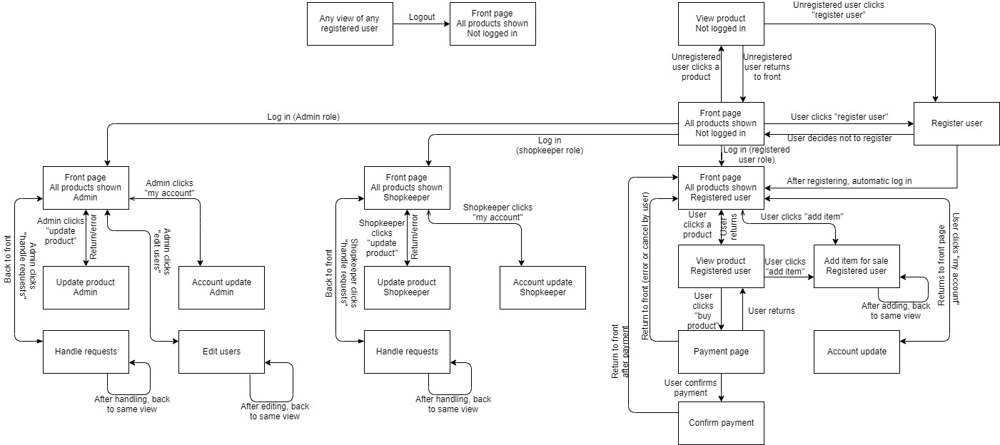
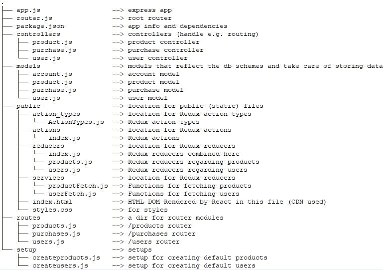

# Online Shop
Online shop application, where users can "buy" products that have been set on sale, and shopkeepers can put products
on sale.

The project was created as a programming course's project work.

Created by: Aleksi Salminen, Markku Nirkkonen, Milla Loimuvirta

## Implemented web shop functionality
Roles implemented: administrator, shopkeeper, user (and unregistered user)

Registered user can see products on sale and buy them if he intends to.
Bank account and credit card are connected to the user. Balance is random amount
between 50 and 1000. Balance increases when ever item added by user is accepted for sale.
Balance of course decreases if user decides to buy a product.
As mentioned, user can add items for sale. User can see his products pending for to be accepted for sale.
At this point, if user does not see anymore his product pending, the truth lies
on his bank account. In other words, our UI does not tell the user if the product was
accepted or not. User can also edit his own account information - name, email, password etc. And
of course user can unregister at any time.

Unregistered user is not a specified role in our system. However, any non-logged in user
can see products and also take a look at one specific item.

Shopkeeper is a role for employees of the shop. There can be many shopkeepers.
Shopkeeper has rights to accept or reject users item offered for sale. If rejected, the
product is deleted from the database. If accepted, shopkeeper sets selling price for the
product and product comes up for sale. 

Shopkeeper can also add items for sale, but we implemented
this in a special way: shopkeeper adds items for sale on behalf of the shop. Items are
accepted for sale right away, but shopkeeper does not get paid (initial price is 0). Shopkeeper
sets selling price. Future buyer is being charged, so shop gets all the money from this product.
In real life this would mean that shopkeeper sets products, that the shop has purchased from 
somewhere else, for sale. We think, that if shopkeeper wants to sell his own products, shopkeeper
can register any time as regular user.

Administrator has all the rights as shopkeepers have (accept/reject products), but in addition administrator can edit other
users. However, administrator can not self edit his own account. That might be help desk guru's or someone else's job...

We implemented also purchases in the back end, but did not have time to use them in the UI.
Every time when product is bought, information about the purchase is stored in the database 
(buyer, last 4 digits of credit card, product name, price etc.). This info could be used in
for example user's history of bought products, or shopkeeper could go through every purchase etc.

Our UI is rough, but it has almost all the requirements. However, system does not always
give so much feedback for user. For example, if user is out of balance when trying to buy a product,
UI does not give too much hints (console does at this point). Product just stays on sale, if user
is out of balance. The same happens if user without bank account tries to buy product (only
user without account should be admin). Inputs should be validated in at least almost all input fields users fill,
minor issues might have gone through our manual testing.

## Good to know

We did not have time to implement this functionality: Updating products prices (by admin/shopkeeper).

App should work properly in every basic situation, however there always might be something
we didn't notice.

## Instructions

App should run after these lines:

npm install
node app.js

App creates automatically 2 products and one user of each role in the beginning, with following data:
User
- username: user@email.com
- password 1234567890

Shopkeeper
- username: shopkeeper@email.com
- password 1234567890

Admin
- username: admin@email.com
- password 1234567890

Happy web shoppin'!

## Pages and navigation  

  
## Project Structure
Our app's structure follows MVC style and is as follows:

## Mongo database and Mongoose schemas
User schema
- name: String
- email: String, Unique
- password: String
- role: String

Account schema
- creditCard: String,unique
- accountNumber: String,
- balance: Number
- ownerID: String

Product schema
- name: String
- description: String
- purchasePrice: Number
- sellingPrice: Number
- accepted: Boolean
- ownerID: String

Purchase schema
- buyerID: String
- buyerCredit4last: String
- productName: String
- ownerID: String
- purchasePrice: Number
- sellingPrice: Number
- date: Date

User schema is used to define an individual user's attributes, their type and other
limitations related to the user's attributes that will be saved to the database.
- roles: user, shopkeeper, admin

Account schema is used to define individual bank account's attributes, their type and other
limitations related to the user's attributes that will be saved to the database.
Account is connected to a user by ownerID attribute.

Product schema is used to define an individual product's attributes, their type and other
limitations related to the product's attributes that will be saved to the database.
Product is connected to a user by ownerID attribute.
- purchasePrice is the initial price that initial seller sets
- sellingPrice is set after the product is accepted for sale forward

Purchase schema defines purchases. Creating a new purchase is triggered when product is bought.
Purchase is connected to users by buyerID and ownerID (initial seller) attribute.

## API

User requests the main page:
GET localhost:3000/

When the client receives the main page, the list of products will be fetched:
GET localhost:3000/products

When the user logs in:
POST localhost:3000/users/login

When the user registers:
POST localhost:3000/users/register

When the user selects a product:
GET localhost:3000/products/:id

When the user chooses to buy a product:
POST localhost:3000/products/buy/:id

When the user wants to add a product for sale:
POST localhost:3000/products

When admin or shopkeeper wants to see pending products waiting for to be accepted
for sale:
GET localhost:3000/products/pending

Registered user sees one's products waiting for to be accepted/rejected
for sale:
GET localhost:3000/products/my

Administrator or shopkeeper sees shop's own product put on sale:
GET localhost:3000/products/onsale

When the admin/shopkeeper changes users information:
PUT localhost:3000/users/:id

When the user gets own information:
GET localhost:3000/users/me

When the user changes own information:
PUT localhost:3000/users/me

When the user unregisters:
DELETE localhost:3000/users/me

When the shopkeeper/admin changes product information:
PUT localhost:3000/products/:id

When the shopkeeper/admin accepts a new product for sale:
PUT localhost:3000/products/:id

When a product was bought:
DELETE localhost:3000/products/:id

When the administrator deletes user:
DELETE localhost:3000/users/:id

When admin/shopkeeper wants to take a look at purchases done
GET localhost:3000/purchases

When user finally decides to purchase a product
POST localhost:3000/purchases

When user wants to take a look at purchases made by himself
GET localhost:3000/purchases/myPurchases

## React and Redux
React renders the view according to the state that is handled with Redux.

Redux stores a state handled by following reducers:
- authentication,
- userList,
- selectedUser,
- unregistered,
- updatedUser,
- deletedUser,
- ownInformation,
- productList,
- addedProduct,
- selectedProduct,
- boughtProduct,
- pendingProducts,
- ownProducts,
- ownProductsOnSale

React DOM is rendered with following components 
- Provider (gets store as props)
- App (connects mapStateToProps, mapDispatchToProps and creates Browser)
- Browser (gets mapStateToProps and mapDispatchToProps as props)

Following class components are used for rendering different views
with different dispatch functions and states as props
- AccountView
- Products
- Product
- MyProducts
- PendingProducts
- AddProductView
- Users
- Signup
- Login

## Testing  
Backend testing is the priority, if we have time we will do other tests too.
In the end, we did not have time to implement automatic testing.
